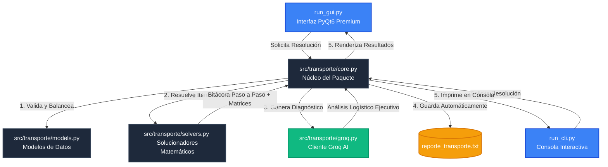

# 🧮 Sistema Inteligente de Optimización de Transporte

Una suite premium, modular y robusta para modelar y resolver problemas de transporte y distribución en logística, un tema central de la **Programación Matemática** e Investigación de Operaciones. 

Este proyecto implementa solucionadores deterministas desde cero (sin dependencias matemáticas externas), una potente interfaz gráfica (GUI) unificada basada en PyQt6 y una interfaz de consola (CLI) interactiva. Adicionalmente, cuenta con integración nativa con la **API de Groq (Llama 3)** para proporcionar diagnósticos, análisis de sensibilidad y recomendaciones logísticas con Inteligencia Artificial.

---

## 🚀 Características Principales

*   **Algoritmos de Optimización Avanzados:**
    *   **Método de la Esquina Noroeste:** Asignación inicial clásica y sistemática.
    *   **Método del Costo Mínimo:** Algoritmo goloso (greedy) que prioriza tarifas óptimas.
    *   **Método de Aproximación de Vogel (VAM):** Evaluaciones basadas en penalidades de costo de oportunidad.
*   **Gestión Inteligente de Matrices:**
    *   **Balanceo Automático:** Detección de diferencias entre Oferta y Demanda totales con inyección automática de orígenes o destinos ficticios ($0 de costo unitario).
    *   **Manejo de Degeneración:** Detección precisa de agotamientos simultáneos de oferta/demanda con cancelación matemática en tiempo real.
    *   **Bitácora Paso a Paso Visual:** Muestra detalladamente la matriz de asignaciones en cada iteración individual con alineación perfecta de columnas.
*   **Análisis y Diagnóstico con IA:** Integración con Groq API para formular conclusiones ejecutivas, evaluaciones de estabilidad y recomendaciones prácticas.
*   **Exportación Automatizada:** Generación automática de un reporte exhaustivo de auditoría (`reporte_transporte.txt`) al concluir cualquier procedimiento.
*   **Presentación Dual Premium:**
    *   **PyQt6 GUI:** Interfaz espectacular con tema oscuro, cuadrícula de datos tipo Excel interactiva, y renombrado dinámico de nodos mediante doble clic.
    *   **Consola CLI:** Flujo interactivo guiado, estético y con espaciado estructurado de datos.

---

## 🏗️ Arquitectura del Sistema

El proyecto sigue una estructura limpia y altamente modular, aislando la lógica de presentación de la matemática determinista y los clientes de servicios externos:



---

## 📂 Estructura del Proyecto

```text
Ejer/
├── pyproject.toml              # Configuración y metadatos de distribución (PEP 517/518)
├── requirements.txt            # Dependencias de librerías del entorno
├── README.md                   # Esta guía de uso y documentación técnica
├── LICENSE                     # Licencia oficial de distribución MIT
├── .gitignore                  # Reglas de exclusión para control de versiones Git
├── run_gui.py                  # Script lanzador rápido para la aplicación gráfica (GUI)
├── run_cli.py                  # Script lanzador rápido para la consola interactiva (CLI)
├── .env                        # Variables de entorno secretas (Groq API Key)
│
└── src/
    └── transporte/
        ├── __init__.py         # Expone la interfaz pública del paquete
        ├── models.py           # Estructuras de datos (Dataclasses, Vectors, Matrices)
        ├── core.py             # Lógica de validación, balanceo y exportación a TXT
        ├── solvers.py          # Solucionadores deterministas (Noroeste, Costo Mínimo, Vogel)
        ├── groq.py             # Adaptador de servicios Groq AI para resúmenes de IA
        ├── cli.py              # Controlador de la presentación en terminal de comandos
        └── gui.py              # Vista y componentes estéticos de la GUI en PyQt6
```

---

## 🛠️ Tecnologías y Stack

*   **Lenguaje:** Python 3.8+
*   **Interfaz Gráfica:** PyQt6 (Estética premium oscura con hoja de estilos QSS a la medida)
*   **Integración de IA:** Groq SDK (Modelo Llama 3)
*   **Carga de Configuración:** `python-dotenv`
*   **Estándares:** PEP 8, Typings de Python nativos, Arquitectura limpia separada en capas

---

## ⚙️ Instalación y Configuración

### 1. Clonar e Instalar Dependencias
Activa tu entorno virtual e instala los paquetes necesarios para compilar y ejecutar el proyecto:

```bash
pip install -r requirements.txt
```

*Alternativamente*, puedes instalar el paquete de forma local en modo editable para desarrollo:

```bash
pip install -e .
```

### 2. Configurar la API de IA
Para habilitar el asistente automático Groq AI, crea un archivo llamado `.env` en el directorio raíz de la aplicación con tu API Key:

```env
GROQ_API_KEY=gsk_tu_clave_secreta_de_groq_aqui
```

---

## 💻 Instrucciones de Uso

### 🖥️ Interfaz Gráfica (GUI) Premium
Una experiencia premium y reactiva con tema oscuro estilo Slate. Cuenta con tablas dinámicas de entrada tipo Excel que permiten renombrar destinos y orígenes haciendo **doble clic** directamente sobre los encabezados de fila y columna.

Para iniciar la aplicación visual:
```bash
python run_gui.py
```

### 📟 Consola (CLI) Interactiva
Un flujo de consola estético y secuencial con validaciones robustas y menús interactivos. Te guiará paso a paso ingresando nombres y cantidades específicas para oferta y demanda.

Para iniciar el flujo interactivo de comandos:
```bash
python run_cli.py
```

---

## 📄 Licencia

Este proyecto está bajo la Licencia MIT. Consulta el archivo [LICENSE](LICENSE) para obtener más detalles.
# TransportSolver
# TransportSolver
